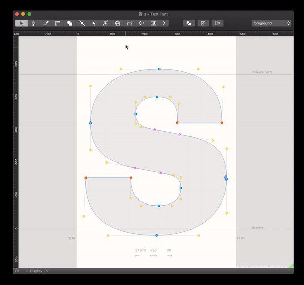

# BezierSurgeon (Beta)

Bezier Surgeon is a Robofont extension for precision point addition. Select the tool, have a segment selected and a new point will be drawn along with its new angle and ratio. (The math used for this follows the same algorithms as Erik van Blokland's [AngleRatioTool](https://github.com/LettError/angleRatioTool/blob/master/AngleRatioTool.roboFontExt/lib/angleRatioTool.py)), this is for cross-tool consistency. 

by Connor Davenport
www.connordavenport.com/

Thanks to Tal, Erik, Frederik, Bahman, and Jens!

