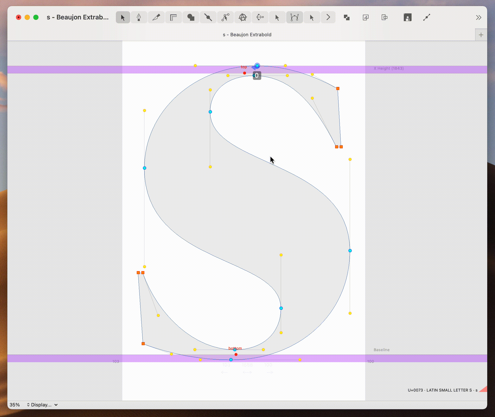
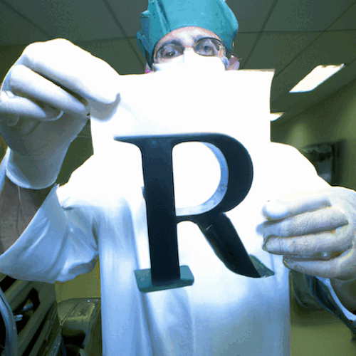

# BezierSurgeon

BezierSurgeon is a Robofont extension for precision point insertion.

Do you ever find your self needing to add a point at an exact angle/ratio for a smooth interpolation? Its a tedious task of guess and check — now you can visualize the new points before editing the curves.

To use it, select the tool from the toolbar at the top of the glyphView. Select a curve and hold down ⇧ shift key and drag around the width of the contour to control the point position. BezierSurgeon has **three** functions for point insertion, CurrentGlyph only - "C", AllFonts at specified Ratio - "R", and AllFonts at what ever is possible - "A". The latter checks if _it is possible_ to insert the point at the same angle in all compatible fonts but if not it will attempt to insert it at the ratio.

BezierSurgeon uses the same math, to calculate the angle and ratio, as [Erik van Blokland's](https://letterror.com/) wonderful [angleRatioTool](https://github.com/LettError/angleRatioTool) to ensure cross-tool consistency. 

Requires RoboFont 4.1

